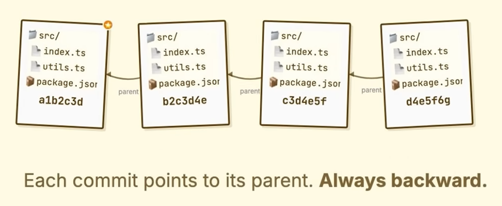

> [!📙] **Git** est un **logiciel de gestion de versions** (**VCS** *version control system)* qui permet de conserver un historique des versions de tous les fichiers.

> [!tip] References
> [LearnThatStack -- Git Will Finally Make Sense After This](https://youtu.be/Ala6PHlYjmw)
>
> [Programming with Mosh -- What is Git? Explained in 2 Minutes!](https://youtu.be/2ReR1YJrNOM)
>
> [QuickRef.ME -- Git Command Cheat Sheet & Quick Reference](https://quickref.me/git)
>
> [GitHub Cheatsheets -- GitHub Git Cheat Sheet](https://training.github.com/downloads/github-git-cheat-sheet/)
>
> [cbeams -- How to Write a Git Commit Message](https://cbea.ms/git-commit/)

**Interfaces de Git**

**Git** est utilisé en **lignes de commande** *(via un terminal de commande ou CLI: Command Line Interface).* D’autres interfaces sont disponibles comme Git-gui, Visual Studio Code avec l’extension GitLens, GitKraken, intégré dans un IDE…

    

**Qu’est-ce qu’un commit ?**

A complete snapshot of the project files:

1. A pointer to the snapshot
2. Metadata: who, when, commit message
3. A pointer to the parent commit

The first commit has no parent

A commit with two parents makes branches

You can jump to any commit in history

    
    

**Historique local `.git`:**

A family tree of snapshots: a Directed Acyclic Graph

L’historique est conservé dans le dossier du projet (`.git/`) qui constitue alors un **dépôt Git.** **Git** est décentralisé, chaque **dépôt** contient toutes les modifications depuis le début.

Nearly Every Operation Is Local

Git Generally Only Adds Data

    
    

**Git Has Integrity**

Everything in Git is checksummed before it is stored and is then referred to by that checksum. 

    
    

**The Three States**

Git has three main states that your files can reside in: modified, staged, and committed:

- **Modified** means that you have changed the file but have not committed it to your database yet.
- **Staged** means that you have marked a modified file in its current version to go into your next commit snapshot.
- **Committed** means that the data is safely stored in your local database.

    

**Gérer un dépôt local `git init / status / log`**

> [!📙] Un **dépôt local** est l’endroit où l’on stocke, sur sa machine, une copie d’un projet, ses différentes versions et l’historique des modifications.

- Créer un dépôt Git : `git init`
- Voir l’état du dépôt : `git status`
    
    `-s [ou --short]`: plus court
    
- Voir les versions du dépôt : `git log`
    
    `--color` : ajouter des couleurs
    
    `--graph` : voir l’historique des branches
    
    `--oneline` : voir l’historique en version réduite
    
    `-1 $$` : Afficher le résumé du dernier commit
    
    `git log .` : Afficher les résumés des commits du dossier courant :
    
- Voir les modifications : `git diff`
    
    `--staged`/`—-cached`

    
        

**Gérer un dépôt distant `git remote / clone / push / pull`**

> [!📙] Un **dépôt distant** est une version dématérialisée du dépôt local, que ce soit sur Internet ou sur un réseau. Il permet de centraliser le travail des développeurs dans un projet collectif comme un *cloud* cf. **les plateformes GitHub, GitLab…**

> [!💡] URL autorisés:
> `ssh://[user@]host.xz[:port]/path/to/repo.git/`
> `git://host.xz[:port]/path/to/repo.git/`
> `http[s]://host.xz[:port]/path/to/repo.git/`
> `ftp[s]://host.xz[:port]/path/to/repo.git/`

> [!📙] `git pull`  équivaut à `git fetch` puis `git merge`

| Relier le dépôt local au dépôt distant | `git remote add <nomDépôt> <urlDépôt>` |
| --- | --- |
| Téléverser des commits vers le dépôt distant | `git push <nomDépôt> [branch]`  |
| Télécharger pour la 1ère fois un dépôt  | `git clone <urlDépôt>` |
| Télécharger une branche d’un dépôt distant:  | `git clone -b <branchname> <urlDépôt>` |
| Télécharger le dépôt sans mettre à jour | `git fetch` |
| Mettre à jour un dépôt local  | `git pull <nomDépôt> [branch]` |

    

**Gérer une branche `git branch`**

> [!📙] La branche par défaut est `main` sur github (anciennement `master`). C’est configurable dans les `config`.

Un pointeur sur un commit

    

Autres pointeurs sur commit

    
`HEAD`  pointe le commit actuel,
`HEAD^`  désigne le dernier commit
`HEAD~2` désigne l’avant dernier commit
`HEAD~3` la troisième,
etc.

    

| Lister les branches | `git branch` |
| --- | --- |
| Créer une branche | `git branch <branch>` |
| Renommer la branche | `git branch -m <ancienNom> <nouveauNom>  [ou --move]` |
| Supprimer une branche vide | `git branch -d <branch> [-d ou --delete]` |
| Supprimer une branche et son contenu | `git branch -D <branch> [-D ou --delete --force]` |
| Basculer de branche (supprime le code non commité) | `git switch <branch>` |
| Fusionner des branches (une fois checkout) | `git merge <targetBranch>` |

    

**Gérer une version `git commit`**

> [!💡] La wildcard `*` peut être utilisé. `*.iml` désigne tous les fichiers qui finissent en `.iml`
> Voir le globbish

| Indexer des fichiers | `git add <fichier1> <fichier2> …` |
| --- | --- |
| Enregistrer une version | `git commit -m "message"` |
| Changer le message | `git commit --amend -m "Votre nouveau message de commit"`  |
| Ajouter un fichier manquant dans un commit | `git add <fichierManquant>;` `git commit --amend

git commit --amend --no-edit` |
| Lister les versions | `git log commit` |
| Revenir à une version | `git reset --hard 8_premiers_chiffres_de_l'id_de_la_version` |

**Reset and move branch`git reset`**

- Annuler les changements en créant un nouveau commit:
`git revert`

Annule les changements sans créer un nouveau commit. 
`git reset`

Plusieurs niveaux de reset:

- `--soft` : ne touche pas à l'index ni au répertoire de travail. Les fichiers en reset retournent juste de la liste des commités à celle à commiter.
- `--mixed` : celui par défaut, mélange des deux précédents. Il laisse les fichiers du répertoire de travail, mais annule l'index.
- `--hard` : efface l'index et le répertoire de travail. Cette option équivaut à un reset + clean.

**Enregistrer les modifications temporaires dans la remise `git stash`**

- Remiser les modifications: `git stash`
- Lister les modifications: `git stash --list`
- Cumuler les modifications `git stash` encore
    
> [!📙] À chaque fois que vous appelez `git stash`, les modifications sont mises de côté dans une pile, au dessus des autres modifications remisées. 
> À chaque fois que vous appelez `pop`, on dépile.
    
- Remiser les modifications et les créations: `git stash save -u`

**Reprendre les modifications remisées**

- Soit en sortant les fichiers du "stash" : `git stash pop`
- Soit en récupérant et laissant les fichiers dans le "stash" : `git stash apply` (nécessite un `git stash drop` pour nettoyer le stash ensuite)

    

Afficher le contenu de la remise : `git stash show`

    
Pour avoir le détail (afficher le diff) `git stash show -p`

- Supprimer les remises : `git stash clear`

**Recombinaison `git rebase`**

- Rebase une branche sur une autre `git rebase <brancheCible>`

- Changer les messages des commit, leur ordre ou leur nombre, 
on peut utiliser le mode interactif (-i). 
Par exemple sur les trois derniers commits :
    
    `git rebase -i HEAD~3`
    

**Move HEAD `git checkout`**

`git checkout` has two main modes:

- Switch branches, with `git checkout <branch>`
- Restore a different version of a file, for example with `git checkout <commit> <filename>` or `git checkout <filename>`

    

**Configuration `git config`**

The configuration file can be stored in three different places. Each level overrides values in the previous level.

- System configuration file at `[path]/etc/gitconfig` with  `--system` option:
    
    Apply to all user on the system and all their repositories. Needs administrative or superuser privilege to make changes.
    
    `C:\ProgramData\Git\config` on Windows. This config file can only be changed by `git config -f <file>` as an admin.
    
- User configuration file at `~/.gitconfig` or `~/.config/git/config` with `--global` option:
    
    This affects all of the repositories you work with on your system.
    
- (Default) Repository configuration file at `.git/config` with `--local` option :
    
    Unsurprisingly, you need to be located somewhere in a Git repository for this option to work properly.
    

| Show all settings on all level | `git config --list --show-origin` |
| --- | --- |
| Set identity | `git config --global user.name "John Doe"` `git config --global user.email johndoe@example.com` |
| Set editor | `git config --global core.editor "'C:/Program Files/Notepad++/notepad++.exe' -multiInst -notabbar -nosession -noPlugin"` `git config --global core.editor "code --wait"` |
| Set default branch name | `git config --global init.defaultBranch main` |

**Ignorer `.gitignore`**

The rules for the patterns you can put in the .gitignore file are as follows:

- Blank lines or lines starting with # are ignored.
- Standard glob patterns work, and will be applied recursively throughout the entire working tree.
- You can start patterns with a forward slash (/) to avoid recursivity.
- You can end patterns with a forward slash (/) to specify a directory.
- You can negate a pattern by starting it with an exclamation point (!).

**Submodule**

- **Config**
    
    
    | Always show submodules in `git status` | `git config --global status.submoduleSummary true` |
    | --- | --- |
    | Always show sub-commits when `git diff` of submodules | `git config --global diff.submodule log` |
    | Fetch only init submodules | `git config --global fetch.recurseSubmodules on-demand` |
- **Register/Deregister**
    
    
    | Register a child repo as submodule (in`.gitmodules`) | `git submodule add <child-repo> <destination-subfolder>` |
    | --- | --- |
    | Add `.gitmodules` to `.git/config`  | **`git** submodule init` |
    | Deregister submodule and turn into classic repo | **`git** submodule deinit <plugin>` |
    | Delete sub repo | **`git** rm -rf <plugin>` |
    | Push repo and all submodules | **`git** push --recurse-submodules=on-demand` |
- **Clone**
    
    
    | Clone the submodule repository | **`git** submodule update` |
    | --- | --- |
    | Clone repo and submodules | `git clone --recurse-submodules <url>` |
- **Fetch and pull**
    
    
    | Fetch repo and submodules | `git fetch` |
    | --- | --- |
    | Pull main repo and submodules | **`git** pull --recurse-submodules` |
    | Pull main repo and Update submodules to the commit specified in the main repository | **`git** pull` 
    **`git** submodule update [--init --recursive]` |
    | Pull rebase for a specific submodule | **`git** submodule update --remote --rebase -- <plugin>` |
- **Push**
    
    
    | **Push** | `git push --recurse-submodules=on-demand` |
    | --- | --- |

